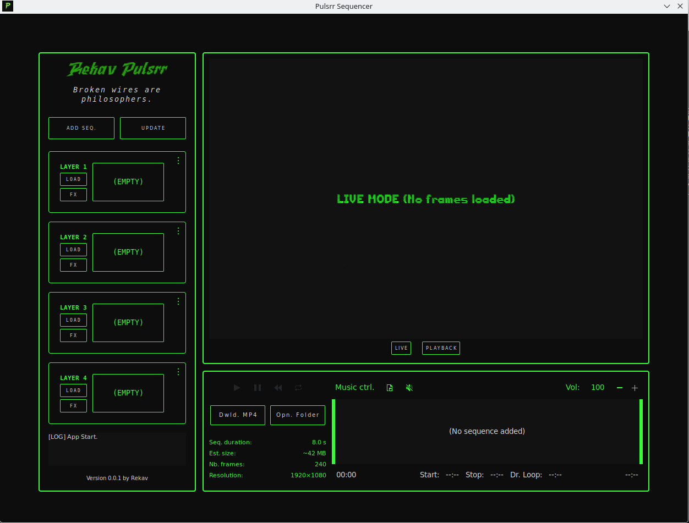
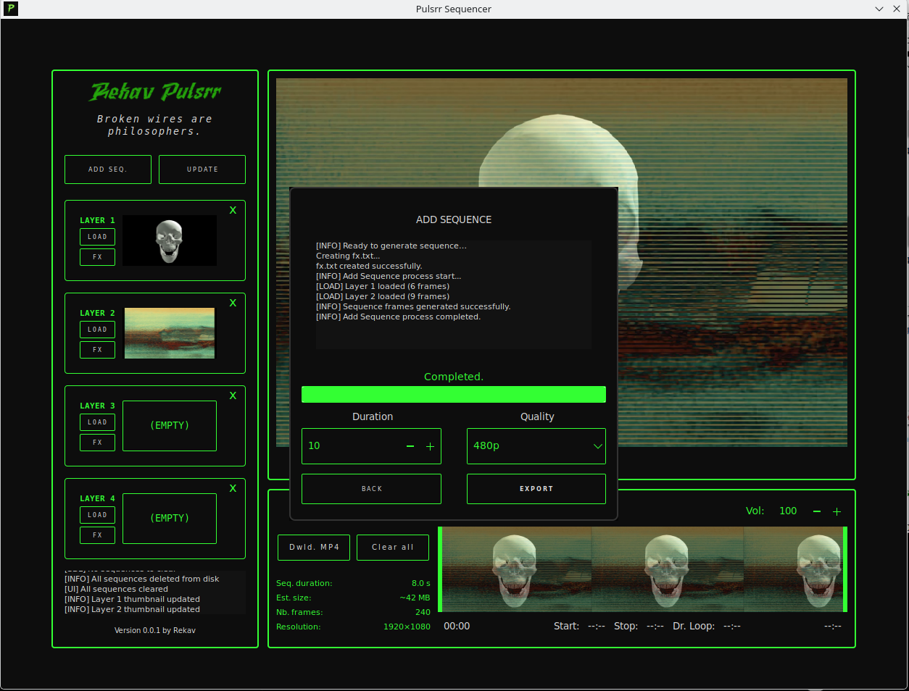

# Pulsrr — Video Sequencer & Mixer (VJ Tool)

Pulsrr is a **Linux-based video mixer and sequencer** designed for **VJ and live visual performance**.  
It allows users to mix **1 to 4 video layers**, apply real-time effects, create sequences, and export the final render as an **MP4 (H.264)** video.

---

## Screenshot




---

## Overview

The core workflow is simple:

1. Load **1–4 videos**, each with independent FPS and scale (quality)
2. Videos are parsed into frames using **FFmpeg**
3. Apply live effects per layer (grayscale, speed, alpha)
4. Click **Update** to render and preview the mixed result
5. Save the result as a **sequence** (duration + scale)
6. Chain multiple sequences together
7. Switch to **Playback mode** to preview the final result
8. Export the full render as an **MP4 video**

---

## Project structure

```
├── .gitignore
├── Makefile
├── media/
│ ├── aphorisms.txt
│ ├── DS-TERM.TTF
│ ├── icon.png
│ └── logo.png
├── src/
│ ├── main.c
│ ├── modals/
│ │ ├── modal_add_sequence.c
│ │ ├── modal_add_sequence.h
│ │ ├── modal_download.c
│ │ ├── modal_download.h
│ │ ├── modal_fx.c
│ │ ├── modal_fx.h
│ │ ├── modal_load_video.c
│ │ └── modal_load_video.h
│ ├── components/
│ │ ├── component_aphorism.c
│ │ ├── component_aphorism.h
│ │ ├── component_layer.c
│ │ ├── component_layer.h
│ │ ├── component_screen.c
│ │ ├── component_screen.h
│ │ ├── component_sequencer.c
│ │ └── component_sequencer.h
│ ├── sdl/
│ │ ├── sdl.c
│ │ └── sdl.h
│ ├── utils/
│ │ ├── utils.c
│ │ └── utils.h
│ └── styles/
│ └── style.css
├── build/
└── README.MD
```

## Technology Stack

- **GTK 3** — UI
- **SDL2** — Rendering engine
- **FFmpeg** — Video decoding & encoding
- **X11 only**  
  > SDL cannot be embedded in GTK under Wayland.  
  > The application explicitly forces X11.

**Target platform:** Linux

---


